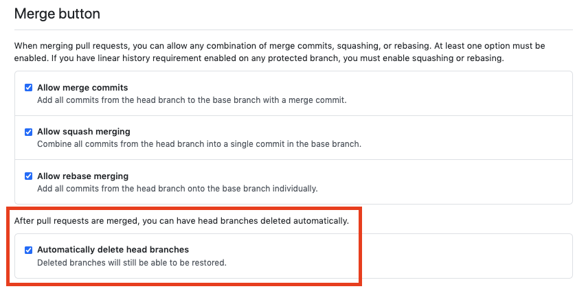

This action is same as



## Exmaple
```yaml
name: Delete Branch After PR Merged

on:
  pull_request:
    types: [closed]

jobs:
  deploy:
    runs-on: ubuntu-latest
    steps:
      - uses: actions/checkout@v2
      - uses: swaglive/actions/delete-branch-after-pr-merged@master
```

This is also work. This action only delete branch when pr merged. But this will produces redundant runs.
```yaml
name: Delete Branch After PR Merged

on:
  pull_request:

jobs:
  clean:
    runs-on: ubuntu-latest
    steps:
      - uses: actions/checkout@v2
      - uses: swaglive/actions/delete-branch-after-pr-merged@master
```
