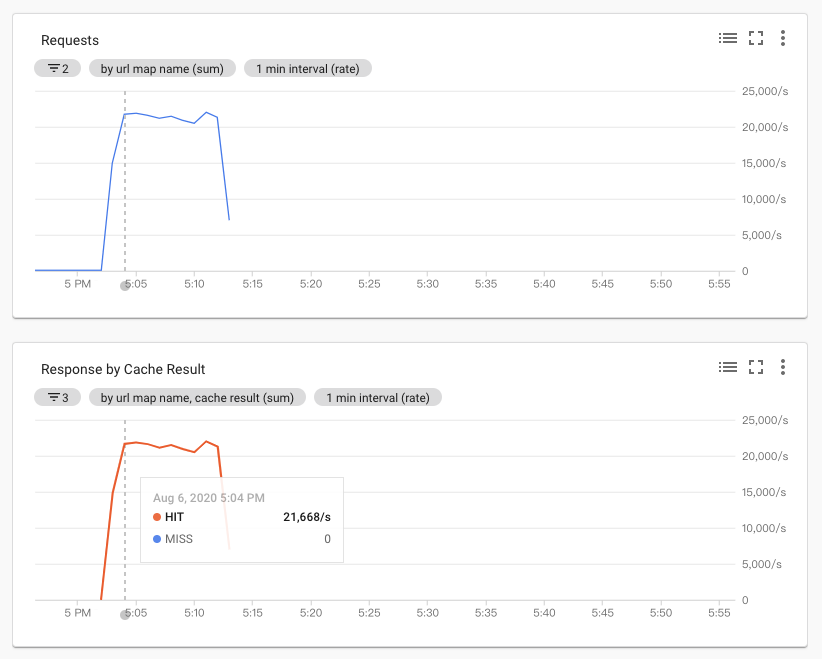
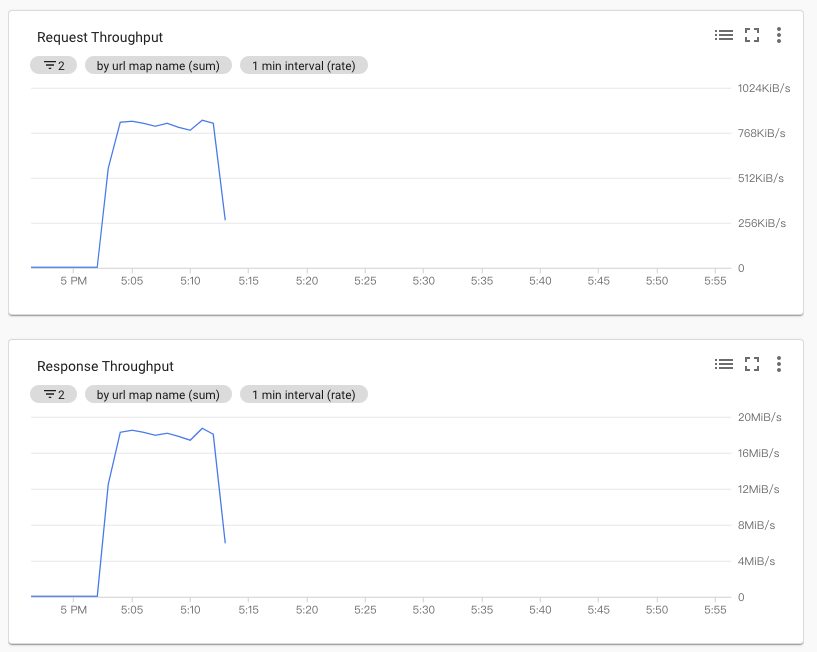

What I learned in 2020.

## 2020-11-10
### Mongo - not master and slaveOk=false
```
rs0:SECONDARY> show dbs
...
	"errmsg" : "not master and slaveOk=false",
	"code" : 13435,
	"codeName" : "NotMasterNoSlaveOk",
...
```

```
rs0:SECONDARY> rs.slaveOk()
rs0:SECONDARY> show dbs
admin   0.000GB
config  0.000GB
demo    0.000GB
local   0.000GB
```

### Could not find host matching read preference { mode: \"primary\" } for set rs0
```json
mongos> sh.addShard( "rs0/mongo-rs0-0.mongo-rs0.testing-mongo.svc.cluster.local:27017,mongo-rs0-1.mongo-rs0.testing-mongo.svc.cluster.local:27017,mongo-rs0-2.mongo-rs0.testing-mongo.svc.cluster.local:27017")
{
	"ok" : 0,
	"errmsg" : "Could not find host matching read preference { mode: \"primary\" } for set rs0",
	"code" : 133,
	"codeName" : "FailedToSatisfyReadPreference",
	"operationTime" : Timestamp(1604989375, 2),
	"$clusterTime" : {
		"clusterTime" : Timestamp(1604989377, 1),
		"signature" : {
			"hash" : BinData(0,"AAAAAAAAAAAAAAAAAAAAAAAAAAA="),
			"keyId" : NumberLong(0)
		}
	}
}

```
- config rs seems ok. not error log on mongos
- mongo mongo-rs0-0.mongo-rs0.testing-mongo.svc.cluster.local:27017 rs0-0, rs0-1 rs0-2 are ok
- rs0-0 is primary, read/write ok

!!! solution
    mongos 版本要和 rs 版本一樣

## 2020-11-08
### GKE - Node auto repair
https://cloud.google.com/kubernetes-engine/docs/how-to/node-auto-repair

GKE 會定期檢查 nodes，如果發生持續性的不健康， GKE 將會開始進行修復的程序。

以 Status:`Ready` 當作基準，以下情況會視為不健康:
- 連續 10 分鐘 Status:`NotReady`
- 連續 10 分鐘沒有任何狀態
- boot disk 用完硬碟空間，超過 30 分鐘

檢查最近的 operations，可以看到有沒有 `auto repair`。
```bash
gcloud container operations list
```

## 2020-11-06
### Kubernetes - Cusotmize a hostname
```yaml
apiVersion: v1
kind: Pod
metadata:
  namespace: testing-mongo
  name: rammus-cf
  labels:
    name: rammus-cf
spec:
  hostname: rammus
  subdomain: cf
  containers:
  - name: nginx
    image: nginx
---
apiVersion: v1
kind: Service
metadata:
  name: cf
spec:
  selector:
    name: rammus-cf
  clusterIP: None
```

在 cluster 裡面可以用
```
curl rammus.cf
```

## 2020-11-03
### GKE node auto repair notes
https://cloud.google.com/kubernetes-engine/docs/how-to/node-auto-repair

GKE 會定期檢查 nodes，如果發生持續性的不健康， GKE 將會開始進行修復的程序。

以 Status:`Ready` 當作基準，以下情況會視為不健康:
- 連續 10 分鐘 Status:`NotReady`
- 連續 10 分鐘沒有任何狀態
- boot disk 用完硬碟空間，超過 30 分鐘

Checking command:
```bash
gcloud container operations list
```

## 2020-10-30
### Sign a GCS object
This will use `gcs-service.json` to generate a URL with expired time `-d 1m`. You can give someone the URL to access `gs://rammus.cf/a-file.txt`.
```
gsutil signurl -d 1m gcs-service.json gs://rammus.cf/a-file.txt
```

## 2020-10-22
### Kubernetes - Install godaddy ssl certificate into secrets kubernetes.io/tls
```
cat 9faxxxxxxxxxxxxx.crt gd_bundle-g2-g1.crt > chain.crt
kubectl create secret tls --cert chain.crt --key generated-private-key.txt rammusxu.tw-tls
```

Test it on local:

1. Add domain in /etc/hosts.
2. Test it with CLI.
```bash
❌ curl -kv https://localhost/ -H 'Host: rammusxu.tw'
👍 curl -kv https://rammusxu.tw

❌ openssl s_client -showcerts -connect rammusxu.tw:443
👍 openssl s_client -showcerts -connect rammusxu.tw:443 -servername rammusxu.tw
```

## 2020-10-19
### Nginx - Cache static with Cache-Control

```
        expires max;
        add_header                      Cache-Control "public";
```

### Nginx - React app serve SPA htmls
ref: https://stackoverflow.com/questions/51367160/nginx-tries-to-find-index-html-in-a-directory-according-to-the-uri
```
        root /app;
        index index.html;
        location / {
            try_files $uri $uri/ /index.html;
        }
```

## 2020-10-16
### Nginx - automatical content type
```nginx
    include    mime.types;
```

path:
- `/usr/local/openresty/nginx/conf/mime.types;`
- `conf/mime.types;`

## 2020-10-07
### Install mongo cli on Mac

ref: https://dba.stackexchange.com/questions/196330/is-it-possible-to-install-just-the-mongo-shell

```bash
brew tap mongodb/brew
brew install mongodb-community-shell
```

### Mongo dump restore
```bash
mongodump --gzip --db=test
# mongorestore <target> <folder>
mongorestore mongodb://localhost:27017 dump
```

## 2020-09-30
### 1 node(s) had volume node affinity conflict.

ref: https://cloud.google.com/kubernetes-engine/docs/concepts/persistent-volumes#pd-zones

Just add `volumeBindingMode: WaitForFirstConsumer`
!!! solution
    ```yaml hl_lines="9"
    apiVersion: storage.k8s.io/v1
    kind: StorageClass
    metadata:
      name: slow
    provisioner: kubernetes.io/gce-pd
    parameters:
      type: pd-standard
      fstype: ext4
    volumeBindingMode: WaitForFirstConsumer
    ```

## 2020-09-29
### GKE don’t enable podpreset

!!! error "no matches for kind "PodPreset" in version "settings.k8s.io/v1alpha1"
    ```
    kubectl apply -f podpreset.yaml
    error: unable to recognize "podpreset.yaml": no matches for kind "PodPreset" in version "settings.k8s.io/v1alpha1"
    ```

no settings.k8s.io API
```
$ kubectl api-resources|grep settings.k8s.io
$ kubectl api-versions|grep settings.k8s.io
```

### kubernetes - Taint and Tolerations
ref: https://godleon.github.io/blog/Kubernetes/k8s-Taints-and-Tolerations/

```
kubectl taint nodes gke-edge-tw-reserved-4c3f498d-068s preemptible=false:NoSchedule
kubectl taint nodes gke-edge-tw-reserved-4c3f498d-068s preemptible=false:NoExecute
```

`preemptible=false:NoExecute` will evicts all pod immediately

this means the pod can tolerate a taint node, so it can be deploy
```yaml
  nodeSelector:
    cloud.google.com/gke-nodepool: reserved
  tolerations:
  - key: "preemptible"
    operator: "Equal"
    value: "false"
```

This can’t deploy
```yaml
  nodeSelector:
    cloud.google.com/gke-nodepool: reserved
  tolerations:
  - key: "preemptible"
    operator: "Equal"
    value: "false"
    effect: "NoSchedule"
```

!!! error "Error Message"
    ```yaml
      conditions:
      - lastProbeTime: null
        lastTransitionTime: "2020-09-29T07:37:03Z"
        message: '0/4 nodes are available: 1 node(s) had taint {preemptible: false}, that
          the pod didn''t tolerate, 3 node(s) didn''t match node selector.'
        reason: Unschedulable
        status: "False"
        type: PodScheduled
    ```

## 2020-09-17
### Give a set of files a hash key
```bash
~ # md5sum a b
d41d8cd98f00b204e9800998ecf8427e  a
d41d8cd98f00b204e9800998ecf8427e  b
~ # md5sum a b | md5sum
fe84858e5913eaed7bf248d8b25a77d7  -
~ # md5sum a b | md5sum | cut -b-32
fe84858e5913eaed7bf248d8b25a77d7
~ # echo a > a
~ # md5sum a b | md5sum | cut -b-32
e849952f425275e21c0d5c46ba2549f5
```

## 2020-09-10
### Kubernetes - VerticalPodAutoscaler
https://cloud.google.com/kubernetes-engine/docs/how-to/vertical-pod-autoscaling

!!! warning "Limitations"
    https://cloud.google.com/kubernetes-engine/docs/concepts/verticalpodautoscaler#limitations_for_vertical_pod_autoscaling

    - Can’t use with HPA


```yaml
  updatePolicy:
    updateMode: "Off"
```

```bash
$ kubectl get vpa my-vpa --output yaml
...
  recommendation:
    containerRecommendations:
    - containerName: my-container
      lowerBound:
        cpu: 536m
        memory: 262144k
      target:
        cpu: 587m
        memory: 262144k
      upperBound:
        cpu: 27854m
        memory: "545693548"
```

## 2020-09-09
### Disable GKE release channel

> ref: https://cloud.google.com/kubernetes-engine/docs/concepts/release-channels#updating_the_cluster_release_channel

It's not possible to exit RAPID channel for now.

```bash
$ gcloud container clusters update edge-tw --release-channel None --region asia-east1
ERROR: (gcloud.container.clusters.update) INVALID_ARGUMENT: Migrating off of releaseChannel RAPID is not supported.
```

### fatal error: linux/version.h: No such file or directory

```bash
In file included from config.h:21,
                 from ae.c:45:
redis_config.h:38:10: fatal error: linux/version.h: No such file or directory
   38 | #include <linux/version.h>
      |          ^~~~~~~~~~~~~~~~~
compilation terminated.
make[1]: *** [Makefile:190: ae.o] Error 1
make[1]: Leaving directory '/redis-cluster-proxy/src'
make: *** [Makefile:4: all] Error 2
```

!!! solution
    ```bash
    apk add linux-headers
    ```

## 2020-09-06
### Upgrade buildx version on Mac

https://gist.github.com/RammusXu/8eb867e2a2dedd3c07149016829da5c3
```bash
docker buildx version

mkdir -p ~/.docker/cli-plugins
BUILDX_VERSION="v0.4.2"
wget https://github.com/docker/buildx/releases/download/${BUILDX_VERSION}/buildx-${BUILDX_VERSION}.darwin-amd64 -O ~/.docker/cli-plugins/docker-buildx
chmod a+x ~/.docker/cli-plugins/docker-buildx

docker buildx version
```

## 2020-09-03
### Nginx - Change host not found response status and content
```bash
curl localhost:8001/host "host:backend"
```

```nginx
location /host {
    resolver 127.0.0.11;
    proxy_pass              http://$http_host$uri;

    proxy_cache_key                 $http_host$uri;
    proxy_cache_valid               200 60s;

    proxy_intercept_errors          on;
    error_page 502 503 =404 /;
}

location @host_not_found {
    echo "not found";
}
```

Host not found
```bash
frontend_1  | 172.18.0.1 - - - MISS [03/Sep/2020:09:01:52 +0000] "GET /host HTTP/1.1" 404 20 "-" "HTTPie/1.0.2" "-"
frontend_1  | 2020/09/03 09:01:52 [error] 6#6: *12 backend2 could not be resolved (3: Host not found), client: 172.18.0.1, server: , request: "GET /host HTTP/1.1", host: "backend2"
frontend_1  | 2020/09/03 09:01:53 [error] 6#6: *13 backend2 could not be resolved (3: Host not found), client: 172.18.0.1, server: , request: "GET /host HTTP/1.1", host: "backend2"
frontend_1  | 172.18.0.1 - - - MISS [03/Sep/2020:09:01:53 +0000] "GET /host HTTP/1.1" 404 20 "-" "HTTPie/1.0.2" "-"
```

Host found
```bash
backend_1   | 172.18.0.3 - - [03/Sep/2020:09:02:30 +0000] "GET /host HTTP/1.0" 200 6 "-" "HTTPie/1.0.2" "-"
frontend_1  | 172.18.0.1 - - - MISS [03/Sep/2020:09:02:30 +0000] "GET /host HTTP/1.1" 200 16 "-" "HTTPie/1.0.2" "-"
frontend_1  | 172.18.0.1 - - - HIT [03/Sep/2020:09:02:38 +0000] "GET /host HTTP/1.1" 200 16 "-" "HTTPie/1.0.2" "-"
```

## 2020-08-27
### 2020 cert-manager request a certificate with ingress in place
> ref: https://kosyfrances.github.io/ingress-gce-letsencrypt/

!!! info "Environment"
    - kuberentes: v1.17.9-gke
    - cert-manager: v0.15.0

```yaml
apiVersion: cert-manager.io/v1alpha2
kind: ClusterIssuer
metadata:
  name: ci-http01
spec:
  acme:
    email: rammus.xu@gmail.com
    server: https://acme-v02.api.letsencrypt.org/directory
    privateKeySecretRef:
      name: issuer-account-key-rammus
    solvers:
      - http01:
          ingress:
            class: ingress-gce
---
apiVersion: networking.k8s.io/v1beta1
kind: Ingress
metadata:
  namespace: web
  name: china-landing
  annotations:
    kubernetes.io/ingress.class: "gce"
    cert-manager.io/cluster-issuer: ci-http01
    acme.cert-manager.io/http01-edit-in-place: "true"
spec:
  tls:
    - hosts:
        - rammus.dev
      secretName: rammus-dev-tls
  rules:
    - host: rammus.dev
      http:
        paths:
          - backend:
              serviceName: http-service-np
              servicePort: http
---
apiVersion: v1
kind: Service
metadata:
  name: http-service-np
  namespace: web
spec:
  type: NodePort
  ports:
  - name: http
    port: 80
    targetPort: http
  selector:
    app: http-app
```

## 2020-08-21
### Copy docker image to another registry
> ref: https://cloud.google.com/artifact-registry/docs/docker/copy-from-gcr#copy-gcloud

```bash
gcloud container images add-tag GCR-IMAGE AR-IMAGE
```

### Nginx - CORS with map example
ref:

- https://blog.51cto.com/tchuairen/2175525
- https://github.com/openresty/headers-more-nginx-module
```conf
map $http_origin $cors_origin {
    default               https://rammus.dev;
    "~rammus2020.dev"     $http_origin;
}

server {
    listen 80;
    location / {
        more_set_headers Access-Control-Allow-Origin $cors_origin;
    }
}
```

### Docker Registry - Gitlab Registry
```bash
docker pull registry.gitlab.com/rammus.xu/docker-alpine:3.12.0
```

- Public git repo = Public docker registry
- No need to login to pull Gitlab public registry image
- [10GB storage, as part of the repository size limit](https://docs.gitlab.com/ee/user/packages/container_registry/#enable-the-container-registry-for-your-project)

```bash
docker login registry.gitlab.com -u rammus.xu -p
docker pull nginx:1.19.2-alpine
docker tag nginx:1.19.2-alpine registry.gitlab.com/rammus.xu/docker-alpine:nginx-1.19.2
docker push registry.gitlab.com/rammus.xu/docker-alpine:nginx-1.19.2

docker pull registry.gitlab.com/rammus.xu/docker-alpine:nginx-1.19.2
```

### Docker Registry - Github Registry

- Can't pull without docker credential
    - `docker login https://docker.pkg.github.com -u rammusxu -p`

```bash
docker login https://docker.pkg.github.com -u rammusxu -p
docker pull nginx:1.19.2-alpine
docker tag nginx:1.19.2-alpine docker.pkg.github.com/rammusxu/docker-alpine/nginx:1.19.2-alpine
docker push docker.pkg.github.com/rammusxu/docker-alpine/nginx:1.19.2-alpine

docker pull docker.pkg.github.com/rammusxu/docker-alpine/nginx:1.19.2-alpine
Error response from daemon: Get https://docker.pkg.github.com/v2/rammusxu/docker-alpine/nginx/manifests/1.19.2-alpine: no basic auth credentials
```

## 2020-08-19
### Dockerhub is rate limiting download layers
- https://www.docker.com/pricing
- https://docs.docker.com/docker-hub/download-rate-limit/
- https://www.docker.com/pricing/retentionfaq
- https://github.com/testcontainers/testcontainers-java/issues/3099
> As of 2020-08-13, Docker have updated their terms of service and pricing page, indicating that:
>
> - unauthenticated pulls will be rate limited to 100 per 6h
> - authenticated pulls will be rate limited to 200 per 6h

Community
- https://www.reddit.com/r/docker/comments/i93bui/docker_terms_of_service_change/
- https://www.reddit.com/r/docker/comments/i9lxq3/docker_reduces_image_retaining_to_6_months_for/

### Where's disk storage location(path) of GKE emptyDir
```bash
# docker container inspect k8s_packager-public_stream-5ad4d9decc14623f43ed1325_default_247be3c5-227d-46cc-9f9c-7aad8cfaeb47_0 | grep Source
                "Source": "/var/lib/kubelet/pods/247be3c5-227d-46cc-9f9c-7aad8cfaeb47/volumes/kubernetes.io~empty-dir/dist",
                "Source": "/var/lib/kubelet/pods/247be3c5-227d-46cc-9f9c-7aad8cfaeb47/volume-subpaths/workdir/packager-public/1",
                "Source": "/var/lib/kubelet/pods/247be3c5-227d-46cc-9f9c-7aad8cfaeb47/volumes/kubernetes.io~secret/default-token-vvrzk",
                "Source": "/var/lib/kubelet/pods/247be3c5-227d-46cc-9f9c-7aad8cfaeb47/etc-hosts",
                "Source": "/var/lib/kubelet/pods/247be3c5-227d-46cc-9f9c-7aad8cfaeb47/containers/packager-public/0fa5ef38",

# df /var/lib/kubelet/pods/247be3c5-227d-46cc-9f9c-7aad8cfaeb47 -h
Filesystem      Size  Used Avail Use% Mounted on
/dev/sda1       2.0T  173G  1.8T   9% /var/lib/kubelet
```

## 2020-08-12
### markdown 文件製作
https://docsify.js.org/#/

## 2020-08-10
### istio on k3d
```bash
curl -L https://istio.io/downloadIstio | sh -
cp istio-1.6.7/bin/istioctl $HOME/bin/

# ~/.zshrc
export PATH=$HOME/bin:/usr/local/bin:$PATH

~ istioctl version
no running Istio pods in "istio-system"
1.6.7
```

```bash
brew install k3d
```

```bash
k3d cluster create dc0 --k3s-server-arg --disable=traefik --publish 8080:80
k3d cluster create dc1 --port 8081:80 --no-lb --k3s-server-arg --disable=traefik
```

```bash
kubectl create namespace istio-system
kubectl create secret generic cacerts -n istio-system \
  --from-file=samples/certs/ca-cert.pem \
  --from-file=samples/certs/ca-key.pem \
  --from-file=samples/certs/root-cert.pem \
  --from-file=samples/certs/cert-chain.pem

# Install istio
istioctl install \
    -f manifests/examples/multicluster/values-istio-multicluster-gateways.yaml

# Update coreDNS
kubectl apply -f - <<EOF
apiVersion: v1
kind: ConfigMap
metadata:
  name: coredns
  namespace: kube-system
data:
  Corefile: |
    .:53 {
        errors
        health
        ready
        kubernetes cluster.local in-addr.arpa ip6.arpa {
           pods insecure
           upstream
           fallthrough in-addr.arpa ip6.arpa
        }
        prometheus :9153
        forward . /etc/resolv.conf
        cache 30
        loop
        reload
        loadbalance
    }
    global:53 {
        errors
        cache 30
        forward . $(kubectl get svc -n istio-system istiocoredns -o jsonpath={.spec.clusterIP}):53
    }
EOF
```

ref: https://dev.to/bufferings/tried-k8s-istio-in-my-local-machine-with-k3d-52gg

### Configure k3d on Mac zsh
```bash
brew instsall k3d
mkdir -p ~/.oh-my-zsh/custom/plugins/k3d/_k3d
k3d completion zsh > ~/.oh-my-zsh/custom/plugins/k3d/_k3d

vi ~/.zshrc
plugins=(... k3d)
```

## 2020-08-07
### Testing websocket
```
npm install -g wscat
docker run -it --rm  -p 10000:8080 jmalloc/echo-server
wscat -c ws://localhost:10000
```

## 2020-08-06
### GCP Monitoring - Response Throughput is including CDN hit

- Miss 0
- Hit 21688/s




### Nginx - add_header is not working on index.html
:white_check_mark:
```conf
      location / {
        add_header                      "Cache-Control" "public, max-age=600000";
        index index.html;
      }
```

:x:
```conf
      location / {
        add_header                      "Cache-Control" "public, max-age=600000";
        index index.html;
      }
```

### CC 4.0 著作權懶人包
ref: https://xie.infoq.cn/copyright

```markdown
<a rel="license" href="http://creativecommons.org/licenses/by-nc-nd/4.0/"></a><br />This work is licensed under a <a rel="license" href="http://creativecommons.org/licenses/by-nc-nd/4.0/">Creative Commons Attribution-NonCommercial-NoDerivatives 4.0 International License</a>.
```

<a rel="license" href="http://creativecommons.org/licenses/by-nc-nd/4.0/"></a><br />This work is licensed under a <a rel="license" href="http://creativecommons.org/licenses/by-nc-nd/4.0/">Creative Commons Attribution-NonCommercial-NoDerivatives 4.0 International License</a>.

基於 CC 4.0 協議進行如下類型授權：

- CC BY（署名）：只要在使用時署名，那麼使用者可以對本創作進行轉載、節選、混編、二次創作以及商業目的使用。
- CC BY-NC（署名+ 非盈利）：只要在使用、公開時進行署名，那麼使用者可以對本創作進行轉載、節選、混編、二次創作，但不得將本創作或由本創作衍生的創作運用於商業目的。
- CC BY-ND（署名 + 禁止演繹）：只要在使用、公開時進行署名，並且對創作不加任何改動，那麼使用者可以使用本創作，包括將其運用於商業目的。
- [CC BY-NC-ND](https://creativecommons.org/licenses/by-nc-nd/4.0/deed.zh_TW)（署名 + 非盈利 + 禁止演繹）：使用者可以對本創作進行轉載，但不得對本創作進行修改，亦不得依據本創作進行再創作，不得將本創作運用於商業用途。
- CC BY-SA（署名+ 繼承）：使用者可以對本創作進行轉載、節選、混編、二次創作，可以將其運用於商業用途，唯須署名作者，並且採用本創作的內容必須同樣採用本協議進行授權。
- CC BY-NC-SA（署名+ 非盈利+ 繼承）：使用者可以對本創作進行轉載、節選、混編、二次創作，但不得運用於商業目的，且使用時須進行署名，採用本創作的內容必須同樣採用本協議進行授權。

## 2020-08-05
### No more google - Google alternatives
https://nomoregoogle.com/
> Privacy-friendly alternatives to Google that don't track you


## 2020-08-03
### Service mesh
https://www.youtube.com/watch?v=-KWvlW9CSn8

- Istio
- Linkerd
- Kuma
- Mosn

## 2020-07-30
### 製作 grouped bar chart online
https://codepen.io/pen/?&editable=true=https%3A%2F%2Fwww.highcharts.com%2Fsamples%2Fhighcharts%2Fdemo%2Fcolumn-basic%3Fcodepen
https://www.highcharts.com/demo

## 2020-07-24
### AB load testing in Alpine Linux
```bash
apk add apache2-utils
ab -n1000 -c10 -k http://localhost/
```

### To generate ECDSA P-256 certificate with step-cli

step-cli: https://smallstep.com/cli/
```
brew install step
```

ref: https://linkerd.io/2/tasks/generate-certificates/#trust-anchor-certificate
```
step certificate create identity.linkerd.cluster.local ca.crt ca.key \
--profile root-ca --no-password --insecure
```

### Import ssl cert to kubernetes secret
```bash
cat 34_120_61_244.crt IntermediateCA.crt > ip.crt

kubectl create secret tls web-ip1 \
  --cert 34_120_61_244.crt \
  --key 34_120_61_244.key \
  -n web

```

update cert
```bash
kubectl create secret tls web-ip1 \
  --cert 34_120_61_244.crt \
  --key 34_120_61_244.key \
  -n web --dry-run -o yaml \
  | kubectl apply -f -
```

## 2020-07-22
### Nginx - Access-Control-Allow-Origin: *
Good
```conf
        more_set_headers                "Access-Control-Allow-Origin: $http_origin";
```

Bad
```conf
        more_set_headers                "Access-Control-Allow-Origin: *";
```


## 2020-07-14
### Is possible to use ip address in ManagedCertificate in GKE?

No.

!!! Error
    ```
    The ManagedCertificate "my-ip1" is invalid: spec.domains: Invalid value: "": spec.domains in body should match '^(([a-zA-Z0-9]+|[a-zA-Z0-9][-a-zA-Z0-9]*[a-zA-Z0-9])\.)+[a-zA-Z][-a-zA-Z0-9]*[a-zA-Z0-9]\.?$'
    ```

```yaml
apiVersion: networking.gke.io/v1beta2
kind: ManagedCertificate
metadata:
  name: my-ip1
spec:
  domains:
    - "34.120.100.100"
```


## 2020-07-06
### Nginx - as an forward proxy server
https://www.alibabacloud.com/blog/how-to-use-nginx-as-an-https-forward-proxy-server_595799
```conf
server {
     listen  443;

     # dns resolver used by forward proxying
     resolver  114.114.114.114;

     # forward proxy for CONNECT request
     proxy_connect;
     proxy_connect_allow            443;
     proxy_connect_connect_timeout  10s;
     proxy_connect_read_timeout     10s;
     proxy_connect_send_timeout     10s;

     # forward proxy for non-CONNECT request
     location / {
         proxy_pass http://$host;
         proxy_set_header Host $host;
     }
}
```

```bash
curl https://www.baidu.com -svo /dev/null -x 39.105.196.164:443
```

## 2020-06-30
### Github API - Delete branch with Personal Access Token
```bash
export INPUT_AUTH_TOKEN=
export GITHUB_REPOSITORY=
export GITHUB_HEAD_REF=

http DELETE "https://api.github.com/repos/$GITHUB_REPOSITORY/git/refs/heads/$GITHUB_HEAD_REF" \
    "Authorization: token $INPUT_AUTH_TOKEN"
```

## 2020-06-24
### Linux - Get Geo infomation in curl
```bash
curl https://ipinfo.io/
{
  "ip": "59.124.114.73",
  "hostname": "59-124-114-73.hinet-ip.hinet.net",
  "city": "Taipei",
  "region": "Taiwan",
  "country": "TW",
  "loc": "25.0478,121.5319",
  "org": "AS3462 Data Communication Business Group",
  "timezone": "Asia/Taipei",
  "readme": "https://ipinfo.io/missingauth"
}
```
```bash
curl ifconfig.co/json
{
    "asn": "AS3462",
    "asn_org": "Data Communication Business Group",
    "city": "Taipei",
    "country": "Taiwan",
    "country_eu": false,
    "country_iso": "TW",
    "hostname": "59-124-114-73.HINET-IP.hinet.net",
    "ip": "59.124.114.73",
    "ip_decimal": 998011465,
    "latitude": 25.0478,
    "longitude": 121.5318,
    "region_code": "TPE",
    "region_name": "Taipei City",
    "time_zone": "Asia/Taipei",
    "user_agent": {
        "product": "HTTPie",
        "raw_value": "HTTPie/1.0.2",
        "version": "1.0.2"
    }
}
```


```bash
curl -s https://ipvigilante.com/$(curl -s https://ipinfo.io/ip)
{"status":"success","data":{"ipv4":"59.124.114.73","continent_name":"Asia","country_name":"Taiwan","subdivision_1_name":null,"subdivision_2_name":null,"city_name":null,"latitude":"23.50000","longitude":"121.00000"}}
```


### Nginx Ingress will use default fake certificate
```yaml
apiVersion: networking.k8s.io/v1beta1
kind: Ingress
metadata:
  namespace: staging
  name: demo
  annotations:
    kubernetes.io/ingress.class: "nginx"
    nginx.ingress.kubernetes.io/ssl-redirect: "false" # Default:true
spec:
  tls:
  - secretName: staging-tls
  rules:
  - http:
      paths:
      - backend:
          serviceName: demo-web
          servicePort: http
```

```bash
curl -kvL https://api.r-live.swaggg.dev

* Server certificate:
*  subject: O=Acme Co; CN=Kubernetes Ingress Controller Fake Certificate
*  start date: Jun 24 04:25:00 2020 GMT
*  expire date: Jun 24 04:25:00 2021 GMT
*  issuer: O=Acme Co; CN=Kubernetes Ingress Controller Fake Certificate
*  SSL certificate verify result: unable to get local issuer certificate (20), continuing anyway.
```

## 2020-06-23
### Intall Google Cloud SDK in docker image

```dockerfile
FROM docker:stable

RUN \
    apk add curl bash python git && \
    curl https://sdk.cloud.google.com | bash -s -- --disable-prompts

ENV PATH $PATH:/root/google-cloud-sdk/bin
```

### Linux - Get external ip in curl cli
ref: https://www.tecmint.com/find-linux-server-public-ip-address/
```bash
$ curl ifconfig.co
$ curl ifconfig.me
$ curl icanhazip.com
$ curl https://ipinfo.io/ip
```

### Kubernetes - GKE/GCP proxy to internal load balancer
- https://cloud.google.com/kubernetes-engine/docs/how-to/internal-load-balancing
- https://cloud.google.com/kubernetes-engine/docs/how-to/internal-load-balancing#global_access

Internal load balancer
```yaml
apiVersion: v1
kind: Service
metadata:
  namespace: default
  name: ilb-api
  annotations:
    cloud.google.com/load-balancer-type: "Internal"

    # This is beta. So it needs to follow this: https://stackoverflow.com/a/59658742/3854890
    # gcloud beta compute forwarding-rules update xxxxx --region us-central1 --allow-global-access
    # networking.gke.io/internal-load-balancer-allow-global-access: "true" # This is for same VPC different region.
spec:
  externalTrafficPolicy: Local
  type: LoadBalancer
  selector:
    role: api
  ports:
  - port: 80
    targetPort: http
    protocol: TCP
```

Proxy service to internal load balancer
```yaml
apiVersion: v1
kind: Service
metadata:
  namespace: web
  name: api-proxy
spec:
  ports:
  - protocol: TCP
    port: 80
    targetPort: 80

---
kind: Endpoints
apiVersion: v1
metadata:
  namespace: web
  name: api-proxy
subsets:
  - addresses:
      - ip: 10.100.0.100
    ports:
      - port: 80
```

### GKE - Internal Load Balancer don't need extra firewalls
ref: https://cloud.google.com/kubernetes-engine/docs/how-to/internal-load-balancing#global_access

no need to add additional firewalls. Default can access same region+project Internal Load Balancer.

- Without global access, traffic originating from clients in your VPC network must be in the same region as the load balancer.
- Global access is enabled per-Service using the following `annotation: networking.gke.io/internal-load-balancer-allow-global-access: "true".`
- Global access is available in Beta on GKE clusters 1.16 and up.


## 2020-06-18
### Linux - adduser without prompts
```bash
adduser runner --disabled-password  --gecos ""
```

### Linux - Add sudoer group to user
```bash
echo "runner ALL=(ALL) NOPASSWD: ALL" >> /etc/sudoers &&\
usermod -aG sudo runner
```

### Github Action Runner - Fix gifsicle: Command failed

!!! solution
    ref: https://github.com/imagemin/imagemin-gifsicle/issues/37#issuecomment-577889854
    ```bash
    apt-get install -y --no-install-recommends autoconf automake libtool dh-autoreconf
    ```

```log
error /home/runner/_work/runner-demo/node_modules/gifsicle: Command failed.
Exit code: 1
Command: node lib/install.js
info Visit https://yarnpkg.com/en/docs/cli/install for documentation about this command.
Arguments:
Directory: /home/runner/_work/runner-demo/node_modules/gifsicle
Output:
⚠ Response code 404 (Not Found)
  ⚠ gifsicle pre-build test failed
  ℹ compiling from source
  ✖ Error: Command failed: /bin/sh -c ./configure --disable-gifview --disable-gifdiff --prefix="/home/runner/_work/runner-demo/node_modules/gifsicle/vendor" --bindir="/home/runner/_work/runner-demo/node_modules/gifsicle/vendor"
config.status: error: in `/tmp/ee647f58-0c5e-49d4-995d-bf84ec21ed4e':
config.status: error: Something went wrong bootstrapping makefile fragments
```

## 2020-06-11
### Failed to determine a valid solver configuration for the set of domains on the Order: no configured challenge solvers can be used for this challenge

That's because Let's encrypt HTTP01 doesn't support wildcard(*) domains.

So, we can't use `*.rammus.cf` in

```yaml
apiVersion: cert-manager.io/v1alpha2
kind: Issuer
metadata:
  namespace: web
  name: rammus
spec:
  acme:
    email: rammus@rammus.cf
    server: https://acme-v02.api.letsencrypt.org/directory
    privateKeySecretRef:
      name: rammus
    solvers:
    {++- http01:++}
       ingress:
         class: nginx
---
apiVersion: cert-manager.io/v1alpha2
kind: Certificate
metadata:
  namespace: web
  name: rammus
spec:
  secretName: rammus-tls
  issuerRef:
    # The issuer created previously
    kind: Issuer
    name: rammus
  dnsNames:
  - 'rammus.cf'
  {--- '*.rammus.cf'--}
  {++- 'api.rammus.cf'++}

```

## 2020-06-05
### gsutil - Verify a google service account with docker and a environment variable

```bash
docker run -it --rm --entrypoint bash gcr.io/cloud-builders/gsutil
sa='{key.json,....}'
gcloud auth activate-service-account --key-file=<(echo $sa)
gsutil ls gs://rammus.dev
```

## 2020-06-02
### Kubernetes - Get client ip from Google Network Load Balancer
https://kubernetes.io/docs/tutorials/services/source-ip/#source-ip-for-services-with-typeloadbalancer
```yaml
spec:
  externalTrafficPolicy: Local
  type: LoadBalancer
```

kubernetes issue: https://github.com/kubernetes/kubernetes/issues/10921

### Direct server return (DSR)
https://blog.envoyproxy.io/introduction-to-modern-network-load-balancing-and-proxying-a57f6ff80236

## 2020-05-26
### Nginx - get request connection id
ref:
- https://stackoverflow.com/questions/17748735/setting-a-trace-id-in-nginx-load-balancer
- http://nginx.org/en/docs/http/ngx_http_upstream_module.html#keepalive
```

    server {
      listen                          80 default_server deferred;

        set  $trace_id  $connection-$connection_requests;

        location / {
            proxy_set_header          Host 'api.swag.live';
            proxy_pass                https://api$request_uri;
            proxy_cache_key           api$request_uri;
            proxy_set_header X-Request-Id $trace_id;
        }
    }
```

### Nginx - proxy_set_header will diable persistent connection
```
proxy_set_header
```

```
      upstream swaglive {
        server                        swaglive.web;
        keepalive                     16;
        keepalive_requests            100000;
      }

      proxy_http_version              1.1;
      proxy_set_header                Connection "";
```

### HTML - Expires and Cache-Control

Cache-Control > Expires

- Expires: HTTP 1.0
- Cache-Control: HTTP 1.1

ref: https://blog.techbridge.cc/2017/06/17/cache-introduction/

## 2020-05-22
### Nginx - use http header as variable
```
$http_name
```
ex:
```
$http_referer
$http_user_agent
$http_x_forwarded_for
```

### Nginx - SSL_do_handshake() failed (SSL: error:1408F10B:SSL routines:SSL3_GET_RECORD:wrong version number) while SSL handshaking to upstream

```
	   proxy_ssl_session_reuse off;
```

### Nginx - server listen 80 default deferred
```config
server {
  listen 80 default deferred;
  ...
}
```

ref: https://stackoverflow.com/questions/8449058/what-does-the-deferred-option-mean-in-nginxs-listen-directive

TCP_DEFER_ACCEPT can help boost performance by reducing the amount of preliminary formalities that happen between the server and client.

> "deferred" is Linux-only. For example on FreeBSD it won't work


### Nginx - Print cache status log
```
    log_format  main  '$remote_addr - $remote_user - $upstream_cache_status [$time_local] "$request" '
                     '$status $body_bytes_sent "$http_referer" '
                     '"$http_user_agent" "$http_x_forwarded_for"';


    access_log  logs/access.log  main;
```

## 2020-05-20
### Nginx - proxy_pass cache prority
1. proxy_cache_path inactive=10m
2. Cache-Control: s-maxage
3. Cache-Control: max-age
4. proxy_cache_valid 200 2s;

https://github.com/RammusXu/toolkit/tree/master/docker/two-layer-nginx


## 2020-05-13
### Probot - update file and create pull request
https://github.com/octokit/rest.js/issues/845#issuecomment-386108187

## 2020-05-05
### Got permission denied while trying to connect to the Docker daemon socket at unix:///var/run/docker.sock: Get http://%2Fvar%2Frun%2Fdocker.sock/v1.40/containers/json: dial unix /var/run/docker.sock: connect: permission denied

!!! solution
    ```
    sudo chmod 777 /var/run/docker.sock
    ```

### Install docker on Debian Linux
```bash
apt-get install     apt-transport-https     ca-certificates     curl     gnupg-agent     software-properties-common
sudo apt-key fingerprint 0EBFCD88
sudo add-apt-repository    "deb [arch=amd64] https://download.docker.com/linux/debian \
  $(lsb_release -cs) \
  stable"
sudo apt-get update
sudo apt-get install docker-ce docker-ce-cli containerd.io
docker run hello-world
```

### ab benchmark is using 1 core
```bash
docker run --rm russmckendrick/ab ab -k -n 20000 -c 2000 https://rammus.cf/
```

Better to use multi-thread benchmark tool
```bash
docker run --rm williamyeh/wrk -t10 -c500 -d30 --latency https://rammus.cf
```

```
apk add wrk
wrk -t10 -c500 -d30 --latency http://localhost:3000
```

Can monitor this behavior with:
```bash
docker stats
```

ab will never over 100%, also need to care about how much resource you give it to docker machine.

## 2020-05-04
### Pemission denied when volumeMounts configmap as file
https://github.com/kubernetes/kubernetes/issues/71356

```log
     subprocess.call(['./demo.sh'])
   File "/usr/local/lib/python3.8/subprocess.py", line 340, in call
     with Popen(*popenargs, **kwargs) as p:
   File "/usr/local/lib/python3.8/subprocess.py", line 854, in __init__
     self._execute_child(args, executable, preexec_fn, close_fds,
   File "/usr/local/lib/python3.8/subprocess.py", line 1702, in _execute_child
     raise child_exception_type(errno_num, err_msg, err_filename)
 PermissionError: [Errno 13] Permission denied: './demo.sh'
```

```yaml
kind: ConfigMap
metadata:
  name: tls-watch-config
data:
  app.py: |
    import subprocess
        subprocess.call(['./update-cert.sh', filename, target_proxy])

  update-cert.sh: |
    echo 'update'
```

```yaml
      volumes:
      - name: workspace
        configMap:
          name: tls-watcher-config
          defaultMode: 0555

      containers:
      - name: tls-watcher
        image: python:3.8-alpine3.11
        volumeMounts:
        - name: workspace
          mountPath: /workspace
        workingDir: /workspace
        command: ["sh", "-c"]
        args:
        - |
          python -u app.py
```

## 2020-04-30
### Generate an unique sha from multiple file in Mac
```
shasum *.json| shasum | cut -d' ' -f1
```

## 2020-04-24
### Nginx: could not find named location

> 2020/04/24 09:34:31 [error] 7#7: *58 could not find named location "@gcsfiles" while sending to client, client: 10.4.4.2, server:

```conf
location ~* '^/(js|img|locale)/' {
  proxy_pass                      http://backend/$uri;
  proxy_cache_key                 rammus.cf$uri;
  add_header                      "Cache-Control" "public, max-age=3600";
  add_header                      Strict-Transport-Security "max-age=86400; includeSubDomains" always;

  proxy_intercept_errors on;
  error_page                      404 = @gcsfiles;
}

location = @gcsfiles {
  proxy_pass                      http://gcs/rammus.cf$uri;
  proxy_cache_key                 $http_host$uri;

  # Enabled HSTS
  add_header                      Strict-Transport-Security "max-age=86400; includeSubDomains" always;
  add_header                      "Cache-Control" "public, max-age=2592300";
}
```

It should be
```conf
{--location = @gcsfiles {--}
{++location @gcsfiles {++}
```
without `=`

## 2020-04-17
### GKE ingress with managed-certificates

```yaml
apiVersion: networking.k8s.io/v1beta1
kind: Ingress
metadata:
  name: web
  namespace: default
  annotations:
    # gcloud compute addresses create gclb-web --global
    # gcloud compute addresses list
    networking.gke.io/static-ip: 1.1.1.1

    # kubectl apply -f certificate.yaml
    # gcloud compute ssl-certificates list
    networking.gke.io/managed-certificates: rammus-cf

spec:
  rules:
  - host: rammus.cf
    http:
      paths:
      - backend:
          serviceName: my-svc
          servicePort: http
  - http:
      paths:
      - backend:
          serviceName: my-svc
          servicePort: http
```
```yaml
apiVersion: networking.gke.io/v1beta1
kind: ManagedCertificate
metadata:
  name: rammus-cf
spec:
  domains:
    - "rammus.cf"
```

## 2020-04-07
### Test a website speed
```
docker run --rm -v "$(pwd)":/sitespeed.io sitespeedio/sitespeed.io:12.3.1 https://app.swag.live
```

## 2020-03-14
### Find other LAN user's IP
```bat
arp -a
```

## 2020-03-13
### 中國的測速網站 https://www.17ce.com/
可以測試 CDN 效果

- benchmark
- warm up

## 2020-03-12
### dnsmasq: unsupported option (check that dnsmasq was compiled with DHCP/TFTP/DNSSEC/DBus support)

!!! solution
    ```bash
    apk --no-cache add dnsmasq-dnssec
    ```

這個錯誤發生在:

- 使用 alpine linux `apk add dnsmasq`
- Enable dnssec

```bash
# /etc/dnsmasq.conf
dnssec
conf-file=/usr/share/dnsmasq/trust-anchors.conf
dnssec-check-unsigned
```

or
```
# /etc/dnsmasq.conf
dnssec
trust-anchor=.,19036,8,2,49AAC11D7B6F6446702E54A1607371607A1A41855200FD2CE1CDDE32F24E8FB5
trust-anchor=.,20326,8,2,E06D44B80B8F1D39A95C0B0D7C65D08458E880409BBC683457104237C7F8EC8D
dnssec-check-unsigned
```

!!! success
    ```bash
    nsmasq_1  | dnsmasq: started, version 2.80 cachesize 150
    dnsmasq_1  | dnsmasq: compile time options: IPv6 GNU-getopt no-DBus no-i18n no-IDN DHCP DHCPv6 no-Lua TFTP no-conntrack ipset auth DNSSEC loop-detect inotify dumpfile
    dnsmasq_1  | dnsmasq: DNSSEC validation enabled
    dnsmasq_1  | dnsmasq: configured with trust anchor for <root> keytag 20326
    dnsmasq_1  | dnsmasq: configured with trust anchor for <root> keytag 19036
    ```

### Parsing dnssec anchors in shell script(bash)
ref:

- https://stackoverflow.com/questions/19908777/curl-and-xmllint-pipe
- https://data.iana.org/root-anchors/root-anchors.xml
```
curl -s https://data.iana.org/root-anchors/root-anchors.xml | \
  xmllint --format --xpath 'concat("trust-anchor=.,", /TrustAnchor/KeyDigest[1]/KeyTag, ",", /TrustAnchor/KeyDigest[1]/Algorithm, ",",/TrustAnchor/KeyDigest[1]//DigestType, ",", /TrustAnchor/KeyDigest[1]/Digest)' -

curl -s https://data.iana.org/root-anchors/root-anchors.xml | \
  xmllint --format --xpath 'concat("trust-anchor=.,", /TrustAnchor/KeyDigest[2]/KeyTag, ",", /TrustAnchor/KeyDigest[2]/Algorithm, ",",/TrustAnchor/KeyDigest[2]//DigestType, ",", /TrustAnchor/KeyDigest[2]/Digest)' -
```

### Commands of testing domain

```bash
apk add bind-tools
```

```bash
nslookup swag.live localhost
nslookup swag.live 127.0.0.1
```

```bash
dig @localhost swag.live
dig @127.0.0.1 swag.live
dig @8.8.8.8 swag.live
```

```
dig +trace swag.live
dig +short swag.live ns
```

```
dig @dnsmasq +dnssec swag.live
dig @dnsmasq +dnssec google.com
```

## 2020-03-11
### Check multiple variables are not None in Python
ref: https://stackoverflow.com/questions/42360956/what-is-the-most-pythonic-way-to-check-if-multiple-variables-are-not-none
```python
params = os.getenv('PARAMS')
sid = os.getenv('SID')
skey = os.getenv('SKEY')
if None in (params, sid, skey):
    print("Must have SID, SKEY, PARAMS")
    exit(1)
```

## 2020-03-10
### GCS roles
Storage Object Admin
```yaml
resourcemanager.projects.get
resourcemanager.projects.list
storage.objects.create
storage.objects.delete
storage.objects.get
storage.objects.getIamPolicy
storage.objects.list
storage.objects.setIamPolicy
storage.objects.update
```

Storage Object Creator
```yaml
resourcemanager.projects.get
resourcemanager.projects.list
storage.objects.create
```

Storage Object Viewer
```yaml
resourcemanager.projects.get
resourcemanager.projects.list
storage.objects.get
storage.objects.list
```

## 2020-03-09
### Get nth line of stdout on linux
ref: https://stackoverflow.com/questions/1429556/command-to-get-nth-line-of-stdout
```bash
ls -l | sed -n 2p
ls -l | head -2 | tail -1
```

### Sort GCS (google cloud storage) objects by date
ref: https://stackoverflow.com/a/51709554/3854890
```bash
gsutil ls -l gs://[bucket-name]/ | sort -r -k 2
```
Example:
```bash
~ gsutil ls -l gs://rammus.cf/download | sort -r -k 2
  62786148  2020-03-06T05:52:53Z  gs://rammus.cf/download/3.0.2.8087.086886.apk
  62732280  2020-03-04T03:07:33Z  gs://rammus.cf/download/3.0.1-8070.apk
  62729059  2020-03-02T16:25:22Z  gs://rammus.cf/download/3_0_1_8ca354.apk
  11  2020-03-02T16:25:03Z  gs://rammus.cf/download/
```

### Measuring kubernetes dns
```bash
bash-5.0# time (for i in {1..100}; do host -U echoserver.ops > /dev/null ; done)

real	0m1.150s
user	0m0.445s
sys	0m0.278s
bash-5.0# time (for i in {1..100}; do host -U echoserver.ops.svc.cluster.local > /dev/null ; done)

real	0m1.762s
user	0m0.463s
sys	0m0.362s
```

```bash
bash-5.0# host -v echoserver.ops
Trying "echoserver.ops.ops.svc.cluster.local"
Trying "echoserver.ops.svc.cluster.local"
bash-5.0# host -v echoserver.ops.svc.cluster.local
Trying "echoserver.ops.svc.cluster.local.ops.svc.cluster.local"
Trying "echoserver.ops.svc.cluster.local.svc.cluster.local"
Trying "echoserver.ops.svc.cluster.local.cluster.local"
Trying "echoserver.ops.svc.cluster.local.google.internal"
Trying "echoserver.ops.svc.cluster.local"

bash-5.0# cat /etc/resolv.conf
nameserver 10.24.0.10
search ops.svc.cluster.local svc.cluster.local cluster.local google.internal
options ndots:5
```

## 2020-03-06
### How does UDP request receiving responses.
- SOCK_STREAM: TCP
- SOCK_DGRAM: UDP

https://stackoverflow.com/questions/1815030/receiving-a-response-through-udp

1. Client emits UDP packet.
2. Router passes UDP packet to the Internet.
3. Router remembers that client sent a UDP packet to server, and establishes a mapping in its memory.
4. Server sends a UDP packet, probably on the same port.
5. Router receives packet, and checks mapping to find client talked to server recently.
6. Router passes packet to client.

https://ns1.com/resources/dns-protocol

DNS communication occurs via two types of messages: queries and replies. Both DNS query format and reply format consist of the following sections:

- The header section contains Identification; Flags; Number of questions; Number of answers; Number of authority resource records (RRs); and Number of additional resource records.
- The flag field contains sections of one or four bits, indicating type of message, whether the name server is authoritative; whether the query is recursive or not, whether request was truncated, and status.
- The question section contains the domain name and type of record (A, AAAA, MX, TXT, etc.) being resolved. Each label in the domain name is prefixed by its length.
- The answer section has the resource records of the queried name.

http://www-inf.int-evry.fr/~hennequi/CoursDNS/NOTES-COURS_eng/msg.html

### Weave Scope - 監控 kubernetes 的工具
ref: https://www.weave.works/docs/scope/latest/installing/#kubernetes

安裝 Weave Scope
```bash
kubectl apply -f "https://cloud.weave.works/k8s/scope.yaml?k8s-version=$(kubectl version | base64 | tr -d '\n')"
```
Expose 服務到 localhost
```
kubectl port-forward -n weave service/weave-scope-app 4040:80
open -a "Google Chrome" "http://localhost:4040"
```

## 2020-03-05
### Try to resolve a domain in kubernetes
Default `/etc/resolv.conf` is like:
```
nameserver 10.24.0.10
search default.svc.cluster.local svc.cluster.local cluster.local google.internal
options ndots:5
```

少於 5 個 dot (.) 將會先搜尋 **search** `default.svc.cluster.local svc.cluster.local cluster.local google.internal`
```bash
> host -v a.a.a.www.google.com
Trying "a.a.a.www.google.com"

> host -v a.a.www.google.com
Trying "a.a.www.google.com.ops.svc.cluster.local"
Trying "a.a.www.google.com.svc.cluster.local"
Trying "a.a.www.google.com.cluster.local"
Trying "a.a.www.google.com.google.internal"
Trying "a.a.www.google.com"

> host -v www.google.com
Trying "www.google.com.ops.svc.cluster.local"
Trying "www.google.com.svc.cluster.local"
Trying "www.google.com.cluster.local"
Trying "www.google.com.google.internal"
Trying "www.google.com"
```

## 2020-03-04
### how-to-perform-ddos-test-as-a-pentester
https://pentest.blog/how-to-perform-ddos-test-as-a-pentester/
### Install netstress on kali linux
```bash
apt-get update
apt-get install netstress
```

### Run kali linux on Kubernetes
```yaml
apiVersion: v1
kind: Pod
metadata:
  name: kali
  labels:
    app: kali
spec:
  ## Select node pool in GKE
  # affinity:
  #   nodeAffinity:
  #     requiredDuringSchedulingIgnoredDuringExecution:
  #       nodeSelectorTerms:
  #       - matchExpressions:
  #         - key: cloud.google.com/gke-nodepool
  #           operator: In
  #           values:
  #           - "pool-1"
  containers:
  - image: kalilinux/kali
    command: ["/bin/sh","-c"]
    args:
    - |
      tail -f /dev/null
    imagePullPolicy: IfNotPresent
    name: kali
  restartPolicy: Never
```

### GKE NodeLocal DNSCache
https://cloud.google.com/kubernetes-engine/docs/how-to/nodelocal-dns-cache

- Base on CoreDNS

### Install dnsperf on alpine
ref:
- https://github.com/ssro/dnsperf/blob/master/Dockerfile
- https://github.com/guessi/docker-dnsperf/blob/master/bench/k8s-dnsperf-bench.yaml
```bash
DNSPERF=dnsperf-2.3.2
apk add --update --no-cache --virtual deps wget g++ make bind-dev openssl-dev libxml2-dev libcap-dev json-c-dev krb5-dev protobuf-c-dev fstrm-dev \
  && apk add --update --no-cache bind libcrypto1.1 \
  && wget https://www.dns-oarc.net/files/dnsperf/$DNSPERF.tar.gz \
  && tar zxvf $DNSPERF.tar.gz \
  && cd $DNSPERF \
  && sh configure \
  && make \
  && strip ./src/dnsperf ./src/resperf \
  && make install
```

```bash
echo "kube-dns.kube-system.svc.cluster.local A" > records.txt
echo "echoserver.ops.svc.cluster.local A" > records.txt

```

```bash
dnsperf -l 10 \
        -s 10.140.0.53 \
        -T 20 \
        -c 20 \
        -q 10000 \
        -Q 10000 \
        -S 5 \
        -d records.txt

dnsperf -l 10 \
        -T 20 \
        -c 20 \
        -q 10000 \
        -Q 10000 \
        -S 5 \
        -d records.txt
```

```
  -l run for at most this many seconds
  -s the server
  -T the number of threads to run
  -c the number of clients to act as to query (default: 127.0.0.1)
  -q the maximum number of queries outstanding (default: 100)
  -Q limit the number of queries per second
  -S print qps statistics every N seconds
  -d the input data file (default: stdin)
```


## 2020-03-03
### Open Google Chrome browser in Mac terminal
```bash
open -a "Google Chrome" "http://localhost:5601"
```

## 2020-03-02
### Create a temporary pod to debug and kill itself after an hour
```yaml
apiVersion: v1
kind: Pod
metadata:
  name: busybox1
  labels:
    app: busybox1
spec:
  containers:
  # - image: busybox
  - image: alpine:3.11
    command:
      - sleep
      - "3600"
    imagePullPolicy: IfNotPresent
    name: busybox
  restartPolicy: Never
```

### DNS load testing in Alpine
```bash
apk add gcc g++ make libffi-dev openssl-dev git
git clone https://github.com/jedisct1/dnsblast.git
cd dnsblast && make
#./dnsblast [host] [times] [request per second]
./dnsblast kube-dns.kube-system 10000 1000
./dnsblast 127.0.0.1 10000 1000
```

- The command above will break kube-dns.
- There are 5 kube-dns pods, but only one is receiving request.
    - Caused by iptable and UDP.

```bash
dnsmasq I0302 08:47:01.002440       1 nanny.go:146[] dnsmasq[23]: Maximum number of concurrent DNS queries reached (max: 1500)
sidecar W0302 08:47:01.248582       1 server.go:64[] Error getting metrics from dnsmasq: read udp 127.0.0.1:37986->127.0.0.1:53: i/o timeout
```

### GKE v1.13.x uses kube-dns rather than core-dns.
ref: https://cloud.google.com/kubernetes-engine/docs/release-notes#new_features_6

GKE is using kube- rather than core-dns. No idea why they are doing this.

### Install gcc compiler in Alpine
ref: https://github.com/nange/blog/issues/3
```bash
apk add gcc g++ make libffi-dev openssl-dev
```
### echo -n
https://linux.die.net/man/1/echo
```bash
-n
do not output the trailing newline
```

## 2020-02-27
### Get GitHub user info
https://developer.github.com/v3/#authentication
```bash
curl -u "username" https://api.github.com/user
curl -H "Authorization: token $PAT" https://api.github.com/user
```

## 2020-02-26
### Use CloudFlare WARP as VPN on Mac/PC
https://community.cloudflare.com/t/tutorial-how-to-use-cloudflare-warp-on-your-mac/129919?fbclid=IwAR3OlvJrv2EW3KoH3GlDA-gURM5BgPKiaP5RDjjlgBHyYpKWbryZzbrPDGw

WARP (CloudFlare VPN) is made from Wireguard. Therefore we can generate a Wirrguard config from CloudFlare and use it on PC.

### Refresh/Clean CDN cache on Tencent Cloud
https://console.cloud.tencent.com/cdn/refresh

Just type what url you want to refresh.

### You might have to verify by doing a request from a location with a Cloudflare edge
I tested it on https://tools.pingdom.com/

- test in Tokyo
- CloudFlare/Google CDN both have edges
- GCS hosting need more DNS time: 40 ms

## 2020-02-24
### CloudFlare worker - Can't resovle/find domain
Need to manully add this record to route worker.
ref: https://community.cloudflare.com/t/a-record-name-for-worker/98841

!!! solution
    Add an A record to 192.0.2.1

### CloudFlare worker - how to handle SPA
I found there's 404 when I tried to refresh in other page like /faq.

ref: https://stackoverflow.com/questions/58432345/cloudflare-workers-spa-with-vuejs
```js
options.mapRequestToAsset = req => {
    // First let's apply the default handler, which we imported from
    // '@cloudflare/kv-asset-handler' at the top of the file. We do
    // this because the default handler already has logic to detect
    // paths that should map to HTML files, for which it appends
    // `/index.html` to the path.
    req = mapRequestToAsset(req)

    // Now we can detect if the default handler decided to map to
    // index.html in some specific directory.
    if (req.url.endsWith('/index.html')) {
      // Indeed. Let's change it to instead map to the root `/index.html`.
      // This avoids the need to do a redundant lookup that we know will
      // fail.
      return new Request(`${new URL(req.url).origin}/index.html`, req)
    } else {
      // The default handler decided this is not an HTML page. It's probably
      // an image, CSS, or JS file. Leave it as-is.
      return req
    }
  }
```

## 2020-02-21
### Multiple static IP in a load balancer
Steps:

1. Manual create ip addresses.
2. Assign ip addresses to load balancer frontend
3. Use `externalIPs` instead of `loadBalancerIP`
```yaml hl_lines="9 10 11 17"
kind: Service
apiVersion: v1
metadata:
  name: dnsmasq
spec:
  selector:
    name: dnsmasq
  type: LoadBalancer
  externalIPs:
  - a.a.a.a
  - a.a.a.b
  ports:
  - name: dnsmasq-udp
    port: 53
    protocol: UDP
    targetPort: dnsmasq-udp
  # loadBalancerIP: a.a.a.a
```

### Testing HPA high memory
ref: https://github.com/feiskyer/kubernetes-handbook/blob/master/examples/hpa-memory.yaml

```yaml
apiVersion: autoscaling/v2beta1
kind: HorizontalPodAutoscaler
metadata:
  name: nginx-hpa
spec:
  scaleTargetRef:
    apiVersion: extensions/v1beta1
    kind: Deployment
    name: dnsmasq
  minReplicas: 1
  maxReplicas: 5
  metrics:
  - type: Resource
    resource:
      name: memory
      targetAverageUtilization: 60
```

and get in a container
```bash
$ kubectl exec -it dnsmasq-5964d6fdc-2ktt8 sh
```

generate high memory usage
```bash
$ yes | tr \\n x | head -c 100m | grep n
```

### About Kubernetes HPA(Horizontal Pod Autoscaler)
ref: https://kubernetes.io/docs/tasks/run-application/horizontal-pod-autoscale

- desiredReplicas = ceil[currentReplicas * ( currentMetricValue / desiredMetricValue )]
- [每 15 秒檢查一次](https://kubernetes.io/docs/tasks/run-application/horizontal-pod-autoscale/#how-does-the-horizontal-pod-autoscaler-work)
- [預設 downscale: 5m](https://kubernetes.io/docs/tasks/run-application/horizontal-pod-autoscale/#support-for-cooldown-delay)


## 2020-02-19

### Use environment from parent process in Nginx(OpenResty)
在 nginx 讀取環境變數的正確方法:

- 先在 root block export 變數
- 使用 lua `os.getenv("MY_ENV"))`
```conf
env MY_ENV;
env PATH;
http {
    server {
        location / {
            content_by_lua_block {
                ngx.say(os.getenv("MY_ENV"));
                ngx.say(os.getenv("PATH"));
            }
        }
    }
}
```

### cannot create an external load balancer with mix protocols
```bash
The Service "dnsmasq" is invalid: spec.ports: Invalid value: []core.ServicePort{core.ServicePort{Name:"dnsmasq", Protocol:"TCP", Port:53, TargetPort:intstr.IntOrString{Type:1, IntVal:0, StrVal:"dnsmasq"}, NodePort:0}, core.ServicePort{Name:"dnsmasq-udp", Protocol:"UDP", Port:53, TargetPort:intstr.IntOrString{Type:1, IntVal:0, StrVal:"dnsmasq-udp"}, NodePort:0}}: cannot create an external load balancer with mix protocols
```


## 2020-02-18
### Try docker-compose health check
https://github.com/peter-evans/docker-compose-healthcheck
```
healthcheck:
  test: ["CMD-SHELL", "pg_isready -U postgres"]
  interval: 10s
  timeout: 5s
  retries: 5
```

### Docker 更新後跳出 docker-credential-osxkeychain 想使用鑰匙圈 ci-db

https://github.com/docker/for-mac/issues/3805#issuecomment-518619953

!!! Solution
    Open `~/.docker/config.json`

    Set `"credsStore":""`

### How to use cc-by-sa license

- Plain text: https://creativecommons.org/licenses/by-sa/4.0/legalcode.txt

- Image: [](http://creativecommons.org/licenses/by-sa/4.0/)
  ```
  <a rel="license" href="http://creativecommons.org/licenses/by-sa/4.0/"></a>
  ```
  ```
  [](http://creativecommons.org/licenses/by-sa/4.0/)
  ```

### Print a colorful text in terminal
[ANSI - 輸出文字變色](../../snippets/bash#ansi-)
```bash
echo -e "\e[1;31mHello\e[0m World"
```

### Render a chart inside markdown with canvasjs

<script>
window.onload = function () {

  var limit = 50000;
  var y = 100;
  var data = [];
  var dataSeries = { type: "line" };
  var dataPoints = [];
  for (var i = 0; i < limit; i += 1) {
    y += Math.round(Math.random() * 10 - 5);
    dataPoints.push({
      x: i,
      y: y
    });
  }
  dataSeries.dataPoints = dataPoints;
  data.push(dataSeries);

  //Better to construct options first and then pass it as a parameter
  var options = {
    zoomEnabled: true,
    animationEnabled: true,
    title: {
      text: "Try Zooming - Panning"
    },
    axisY: {
      includeZero: false,
      lineThickness: 1
    },
    data: data  // random data
  };

  var chart = new CanvasJS.Chart("chartContainer", options);
  chart.render();
}
</script>

<div id="chartContainer" style="height: 370px; width: 100%;"></div>
<script src="https://canvasjs.com/assets/script/canvasjs.min.js"></script>

## 2020-02-15

### Restart a kubernetes resource without down time and using same config(yaml)
Kubernetes >= 1.15

ref: https://github.com/kubernetes/kubernetes/issues/33664#issuecomment-497242094

Gracefully rolling restart deployment.
```bash
kubectl rollout restart deployment/my-sites --namespace=default
```

### Run commnad without(ignoring) output
https://askubuntu.com/questions/474556/hiding-output-of-a-command

```bash
command > /dev/null 2>&1
command >& /dev/null
```

Example:
Still show errors when command failed.
```bash
$ edho hi > /dev/null
zsh: command not found: edho
```
Don't show error even when command failed.
```bash
$ edho hi >& /dev/null
```

## 2020-02-13

### 在 docker-compose 中的容器互相溝通
service name 會被綁到 DNS，可以直接使用 service name 當作 host

```yaml
version: '3'
services:
  redis:
    image: "redis:alpine"
    ports:
      - "6379:6379"
  celery:
    image: "celery:4.0.2"
    environment:
      - CELERY_BROKER_URL=redis://redis
  celery-2:
    image: "celery:4.0.2"
    environment:
      - CELERY_BROKER_URL=redis://redis
```

```bash
$ docker network ls
NETWORK ID          NAME                        DRIVER              SCOPE
01681ec52fea        celery_default              bridge              local
```

```bash
$ docker exec -it celery_celery_1 bash
user@dcd8cf4a9d04:~$ ping celery-2
PING celery-2 (192.168.0.4): 56 data bytes
64 bytes from 192.168.0.4: icmp_seq=0 ttl=64 time=0.162 ms
64 bytes from 192.168.0.4: icmp_seq=1 ttl=64 time=0.223 ms
^C--- celery-2 ping statistics ---
2 packets transmitted, 2 packets received, 0% packet loss
round-trip min/avg/max/stddev = 0.162/0.193/0.223/0.031 ms
user@dcd8cf4a9d04:~$ ping celery-3
ping: unknown host
```

### mkdocs minify html got error
mkdocs.yaml
```yaml
plugins:
  - minify:
      minify_html: true
```

!!! bug
    ```bash
        print "htmlmin option " + key + " not recognized"
                            ^
    SyntaxError: Missing parentheses in call to 'print'. Did you mean print("htmlmin option " + key + " not recognized")?
    ```

!!! solution
    ref: https://github.com/byrnereese/mkdocs-minify-plugin/issues/8

    Upgrade mkdocs-minify-plugin>= ==0.2.3==
