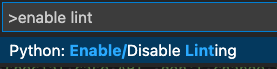
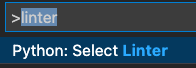

# Visual Studio
## Python env
https://code.visualstudio.com/docs/python/environments
```
python3 -m venv .venv
virtualenv .venv
```

!!! Note
    Command + Shift + P -> Python: Select Interpreter
    Command + Shift + P -> Python: Enable Linting
    Command + Shift + P -> Python: Select Linter




## settings.json
```
    "[python]": {
        "editor.insertSpaces": true,
        "editor.tabSize": 4,
        "editor.formatOnSave": true
    },
    "[yaml]": {
        "editor.defaultFormatter": "redhat.vscode-yaml",
        "editor.formatOnSave": true
    },
```
