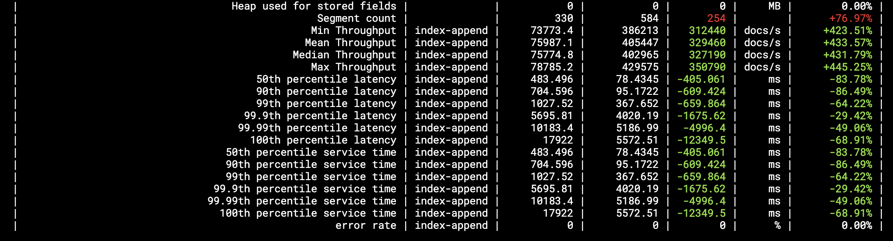

https://www.elastic.co/guide/en/cloud-on-k8s/current/k8s-quickstart.html

## Why
- Upgrade gracefully and automatically, it watches every node health and recreate pod one by one
  - Rolling recreate
    - Upgrade ES version
    - Upgrade ES image
    - Change SSL
    - Update resource
  - No restart reload
    - Increase storage size
    - Update config.yaml
- Monitoring Integration
- Kibana Integration


## Preparation
- [flux2](https://github.com/fluxcd/flux2): for GitOps
  - HelmRepository
  - HelmRelease
- Create CA
  ```bash
  ## Create 10 years CA
  openssl req -x509 -sha256 -nodes -newkey rsa:4096 -days 3650 -subj "/CN=ECK" \
      -keyout tls.key \
      -out tls.crt

  kubectl create secret generic eck-cert -n eckpoc \
      --from-file=ca.crt=tls.crt \
      --from-file=tls.crt=tls.crt \
      --from-file=tls.key=tls.key


  kubectl create secret generic eck-cert -n eck-q2 \
      --from-file=ca.crt=./.dev/tls.crt \
      --from-file=ca.key=./.dev/tls.key
  ## Check
  cat tls.crt | openssl x509 -noout -enddate
  ```

## Benchmark

- 3master,2data,2client
- xlarge(2cpu,8Gmem) vs 4xlarge(16cpu,64Gmem)
-

